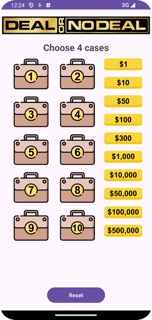
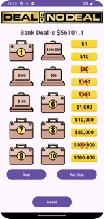
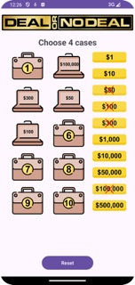
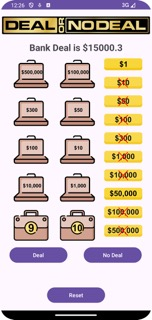
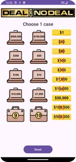
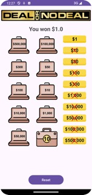

# Deal or No Deal Android App

## Description

This Android application is a digital adaptation of the popular game show "Deal or No Deal." The game randomly assigns dollar amounts to different cases and allows the user to open cases, negotiate with the bank, and potentially win a substantial prize.

## Gameplay Overview

1. **Case Assignment:**
   - At the start of the game, dollar amounts ranging from $1 to $500,000 are randomly assigned to 10 different cases.
   - The assignments are randomized and concealed from the user.

2. **Opening Cases:**
   - The user can click on a closed case to reveal the amount assigned to it.
   - Once a case is opened, its value is displayed to the user.
   - The number of unopened cases remaining is updated accordingly.

3. **First Round:**
   - In the first round, the user is allowed to pick 4 cases.
   - After selecting each case, the revealed amount is displayed, and the remaining cases are updated.
   - Once the user selects the last case of the round, the bank makes an offer, which is 60% of the average value of the remaining unopened cases.
   - The user can choose to accept the offer ("Deal") or decline it ("No Deal").

4. **Second Round:**
   - In the second round, the user again picks 4 cases following a similar process to the first round.
   - At the end of this round, the bank makes another offer, calculated in the same manner as in the first round.
   - The user decides to accept or reject the offer.

5. **Final Round:**
   - In the final round, the user selects one remaining case out of two.
   - The value of the selected case is revealed, and the user's winnings are determined.

6. **Reset:**
   - Clicking the "Reset" button starts a new game, initiating the first round.

## Screenshots

        

        

## Dependencies

- No external dependencies required.

## Installation

- Clone the repository.
- Open the project in Android Studio.
- Build and run the project on an Android device or emulator.

## Author

Jaya Sravani Sirigineedi

## Acknowledgments

- This app was created as part of Mobile Application Development course at UNCC.
